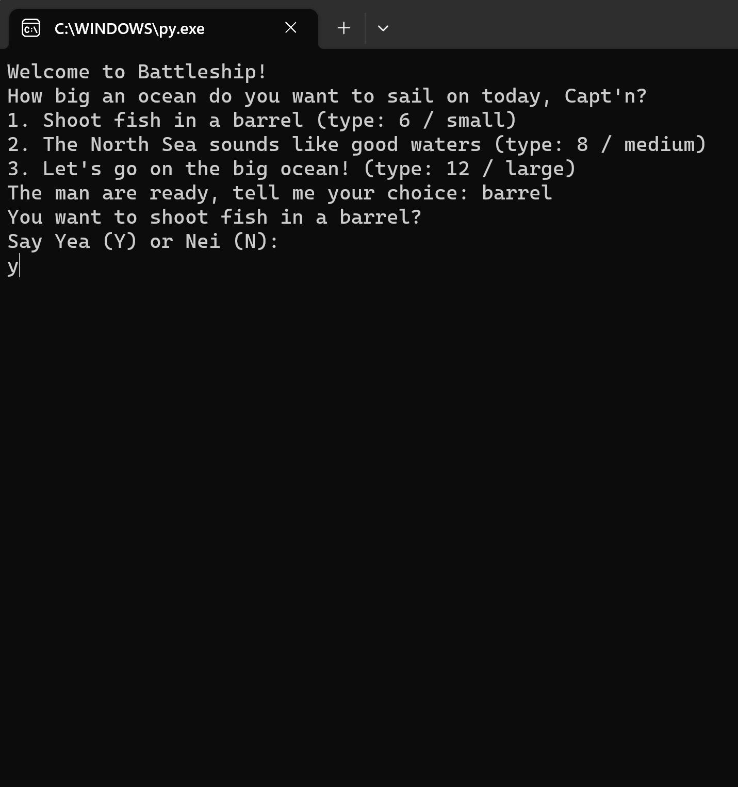
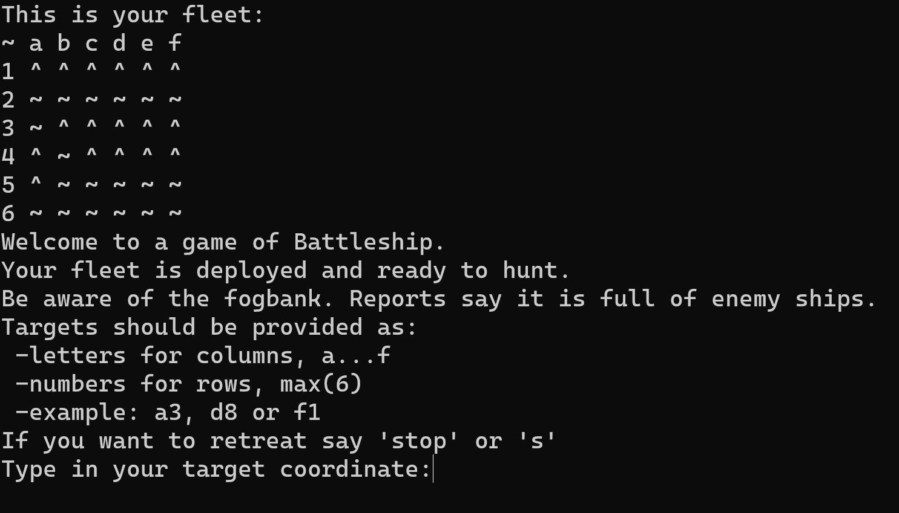
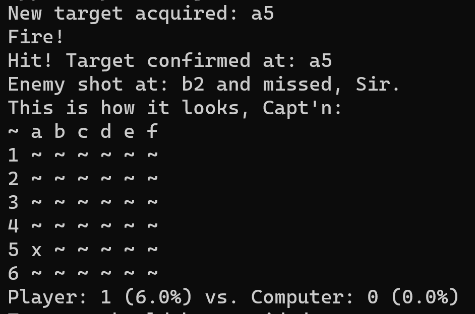
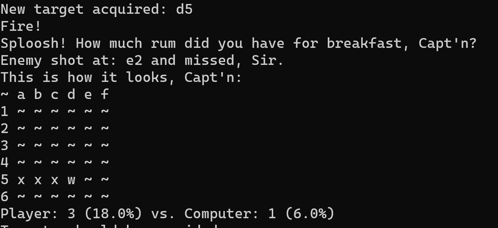
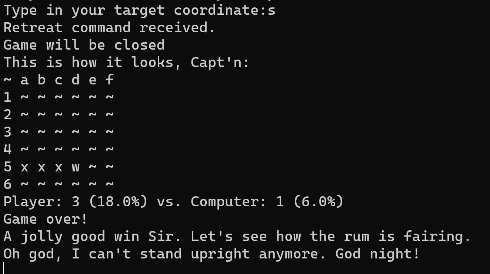
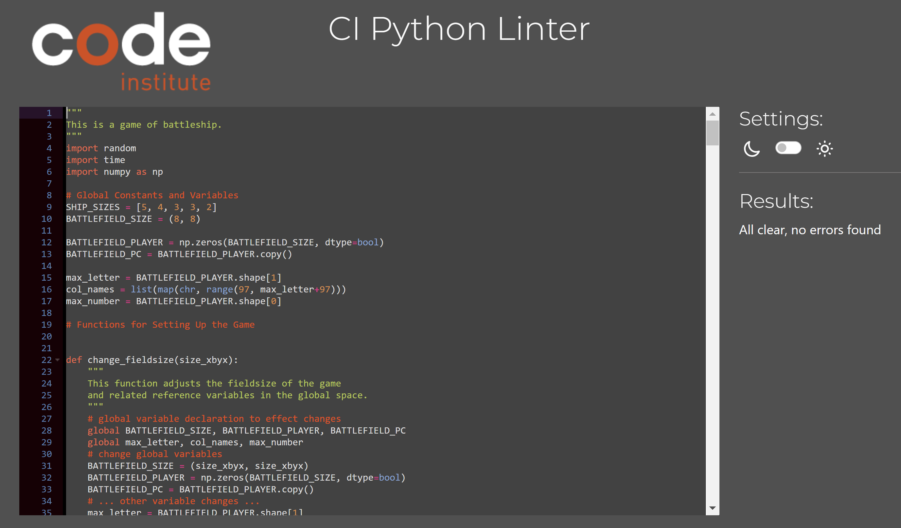

Welcome,

This is my Python version of battleship as of: **August 30, 2023**

## Battleship in python and its features

Battleship is my first command-line based game I've designed. I gave it a bit of a colonial time vibe in its language. So I hope you don't mind a few mentions of rum and bad sailors language when you interact with the game. It's all just for fun.
This version of battleship allows the player to choose between 3 different gameboard sizes at the beginning of the game, namely:
- barrel / small / 6(x6)
- sea / medium / 8(x8)
- ocean / large / 12(x12)

If you don't choose a size after 3 tries it will be set to default (8x8).

Once the player decides apon a field size, 2 random ship deployments are created with the players deployment being shown in the command window at the beginning of the game. Ships are marked by '^'. It's subtle but it wouldn't be any different out in the big yonder.
The number of ships is set to 5 by default. Each player gets a 5 cell, two 4 cell, two 3 cell and one 2 cell ship.
For now ships are set at random but it is written in a way that the randomization could be easily substituted with a user input function without large changes to pre-existing functions.

You will notice the player is than asked for command instructions. Instructions on what kind of commands are required are provided.

If you type in a valid target and get a hit, the command printout will tell you where you shot and if it was succesful. It will also tell you the move of the pc opponent before showing you a status map with an x marking the spot where you hit a ship, followed by a score sheet with your progress.

If you don't hit something, you will notice 1 out of 3 random comments about your skills in hitting targets and see your miss displayed with 'w' on the map print. This looks the most like a cannonball droping in the water.

If you want to shoot at invalid positions. The command will not be executed and you will be asked to try again until you give a valid command. Note that already used valid targets can not be used again as valid input a second time. The program doesn't allow you to shoot the same position twice.

You can end the game at anytime by typing 'stop' or 's' and the program will sum up your current progress with another comment depending on the outcome. After which the program will exit. Easy and simple.
You can't call the game to stop before you started playing i.e., when you are in the section about choposing the board size.

You might notice some delays in occuring printouts when you run the game. This is intentional to make it easier for the player to notice new prompts and have time to read them before a new prompt comes. All of the delays implemented in the code are limited to a few seconds. So this is not the program doing something unintentional in the background, it is just giving you time to read.

## Data Model
The program requires numpy to run. 
I decided to use global variables for SHIP_SIZEs, BATTLEFIELD_SIZE instead of one single board class to handle all the information.
The ship deployment is recorded in BATTLEFIELD_PLAYER and BATTLEFIELD_PC, two numpy arrays.
As I'm used to Matlab coding with matrices, numpy presented some of the closest analogies in coding to what I'm used to from Matlab. This is very evident in the ship placement. My first instinct was to work in seperate variables rather than what I know as structures in Matlab or classes from python. I tend to use those mostly in more complex programs. I hope you don't mind.

This are the steps performed while placing ships on the board:
1. First a X,Y coordinate in the grid is randomly selected as seed point for a ship.
2. Than the program selects at random, if the ship is going to be oriented along a column or row.
3. The column or row is extracted as a vector and the ship is placed in a free gap preferably starting at the seed coordinate or adjacent. If there is no space available the ship is not placed and another try is initiated.
4. If a ship could be deplayed the extracted vector is reintegrated into the deployment matrix BATTLEFIELD_PLAYER or BATTLEFIED_PC.
5. Ship placememt is done using while loops to allow for multiple tries.

Multiple other functions are used to handle the user input and create the game responses. The most complex are the ones assciated with ship placement and main() because it holds the main gameplay organisation. All functions are annotated to make understanding easier.

## Testing and debugging
I tested a lot of the functionality during development. I had to check a lot on how functions are employed to get familiar with the language using numpy.org and sites like w3schools.com, python forums and looking back at the Code Institute tutorials. 

The most trouble came from ship deployment as I wanted it to work my way and I had to fix several infinity loops where ships were not placed properly due to failures in gap finding. This was an issue mostly to do with getting to now the handling of indexing and index creation from nparrays.
So I spend a lot of time running those functions under different input scenarios to fine tune the code. I think I've tested pretty much all the bugs that came to my mind or that I encountered during running the code. The current state of the program is good. It runs without any issues.

I had to switch writing the code on multiple platforms during the development due to issues with IDEs. I have constantly issues with CodeAnywhere timebudgets. I guess because it counts on when its idle. It's gotten verse with every project. Because I could do this project solely in python I actually developed most code using jupyter-lab after I had the core functions build in CodeAnywhere and it stopped working again. Once I had it build and running properly I went back to tutor support and they helped me switch to Gitpod to finish commiting and deployment preparation because they couldn't get CodeAnywhere to unlock either. 

## Vaildator Pylint on console

Once everything was running on Gitpod I tested the code with Pylint and improved it according to the outcome of the test while making sure it didn't cause unexpected issues to employ those changes.
My Pylint progress and the final test details are stated below:

-----------------------------------
Your code has been rated at 6.71/10
------------------------------------------------------------------
Your code has been rated at 8.37/10 (previous run: 6.71/10, +1.66)
------------------------------------------------------------------
Your code has been rated at 9.05/10 (previous run: 8.37/10, +0.68)
------------------------------------------------------------------
Your code has been rated at 9.24/10 (previous run: 9.05/10, +0.19)
------------------------------------------------------------------
Your code has been rated at 9.34/10 (previous run: 9.24/10, +0.10)
------------------------------------------------------------------
Your code has been rated at 9.41/10 (previous run: 9.34/10, +0.07)

************* Module run
run.py:28:4: W0603: Using the global statement (global-statement)
run.py:29:4: W0603: Using the global statement (global-statement)
run.py:102:0: R0914: Too many local variables (20/15) (too-many-locals)
run.py:153:11: W0718: Catching too general exception Exception (broad-exception-caught)
run.py:214:12: C0103: Variable name "it" doesn't conform to snake_case naming style (invalid-name)
run.py:230:16: C0103: Variable name "it" doesn't conform to snake_case naming style (invalid-name)
run.py:272:4: W0621: Redefining name 'created_scoreboard' from outer scope (line 298) (redefined-outer-name)
run.py:277:4: C0103: Variable name "pc" doesn't conform to snake_case naming style (invalid-name)
run.py:354:8: R1705: Unnecessary "else" after "return", remove the "else" and de-indent the code inside it (no-else-return)
run.py:433:0: R0914: Too many local variables (19/15) (too-many-locals)
run.py:438:4: W0602: Using global for 'BATTLEFIELD_SIZE' but no assignment is done (global-variable-not-assigned)
run.py:438:4: W0602: Using global for 'SHIP_SIZES' but no assignment is done (global-variable-not-assigned)
run.py:439:4: W0603: Using the global statement (global-statement)
run.py:443:12: C0103: Variable name "pc" doesn't conform to snake_case naming style (invalid-name)
run.py:433:0: R0912: Too many branches (14/12) (too-many-branches)
run.py:433:0: R0915: Too many statements (66/50) (too-many-statements)

------------------------------------------------------------------
Your code has been rated at 9.47/10 (previous run: 9.41/10, +0.07)

I think the remaining issues are mostly esthetic and not necessary given the left time constraints for deployment without major changes to the program set up (this relates mainly to too many branches, statements, variables issues from the test). The global statements are necessary as far as I can see to avoid issues in the program. The 'else' issue would break the function if corrected as suggested.

## Validator PEP8

PEP8 validator showed no errors online.

## Credits

- Wikipedia for game details
- Code Institute for tutorials and help with IDE account troubleshooting
